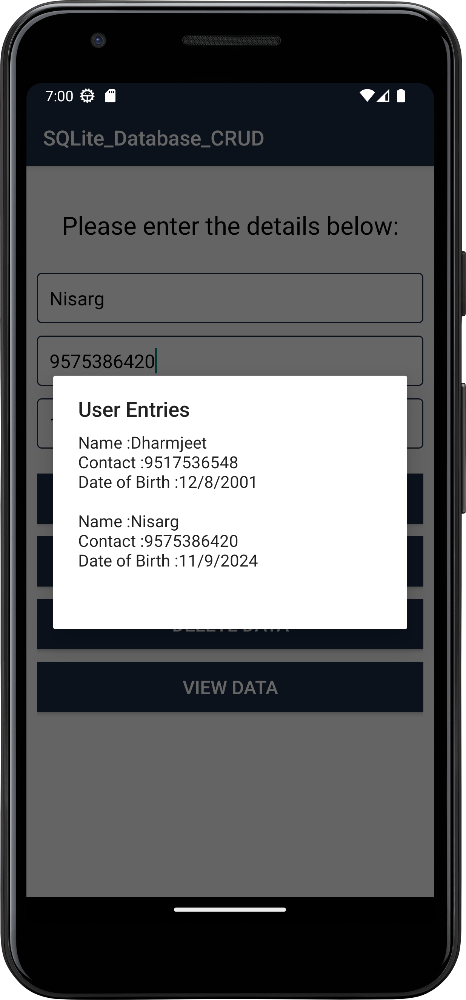

# About
This project demonstrates a simple Android application for managing user data with CRUD (Create, Read, Update, Delete) operations. It utilizes an SQLite database to store user information including name, contact, and date of birth.

# Features

- Insert new user data
- Update existing user data
- Delete user data
- View all user data
- Date picker for selecting date of birth

       
# Tools used

- Android Studio
- Java Development Kit (JDK)
- Android SDK
  
# How to install?

- Step:1
    - Clone the repository:

```
git clone https://github.com/DharmjeetVala/SQLite-Database-CRUD-Operations.git
```
- Step:2
    - Open Android Studio.
    - Click on File -> Open and navigate to the cloned repository.
    - Select the project to open it.
- Step:3 
    - Connect your Android device or start an emulator.
    - Click on the Run button in Android Studio to build and deploy the application.

# Project Structure
- MainActivity.java: The main activity that handles the UI and user interactions.
- DBHelper.java: The SQLite database helper class that manages database creation and version management.
- activity_main.xml: The main layout file defining the UI components.
- styles.xml: Defines the styles for the application.
# Preview:
<div style="display: flex; flex-wrap: wrap; gap: 30px;">
  
  
  
   
   
</div>


<br/><br/>
Thanks

Regards ~ Dharmjeet Vala


